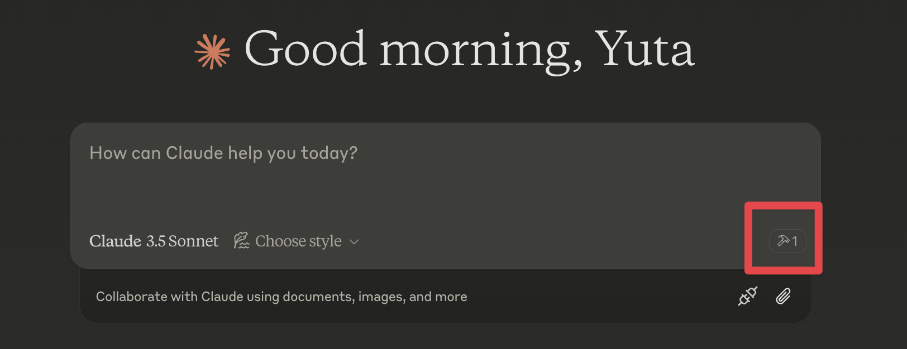
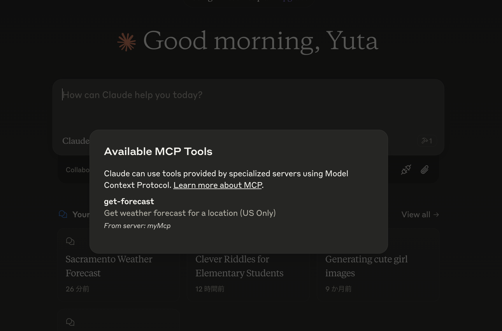

# Weather MCP Server

天気の情報を取得するMCPサーバー

## Getting Started

### 1. Claude Desktopをダウンロードする

https://claude.ai/download

### 2. MCPサーバーをビルドする

```sh
$ npm install
$ npm run build

# build/main.jsのフルパスを表示する
$ find `pwd` -maxdepth 2 -name main.js
```

### 3. Claude Desktopの設定でMCPサーバーを登録する

> [!NOTE]
> 以下は、macOS版でのやり方です。その他のOSについては[公式ドキュメント](https://modelcontextprotocol.io/quickstart/server#:~:text=Testing%20your%20server%20with%20Claude%20for%20Desktop)を参照してください。

```sh
$ vi ~/Library/Application\ Support/Claude/claude_desktop_config.json
```

```json
{
  "mcpServers": {
    "weather": {
      // NOTE: nodeのフルパスを指定（`$ which node`）
      "command": "node",
      // NOTE: build/main.jsのフルパスを指定
      "args": ["xxx/build/main.js"]
    }
  }
}
```

### 4. Claude DesktopでMCPサーバーが登録されていることを確認する

Claude Desktopを再起動し、MCPサーバーが登録されていることを確認する




試しにサンフランシスコの天気を聞くと、MCPサーバーから天気予報の情報を取得し、生成AIのメッセージに天気の情報が組み込まれていることがわかる。


（参考）MCPサーバーがない場合


